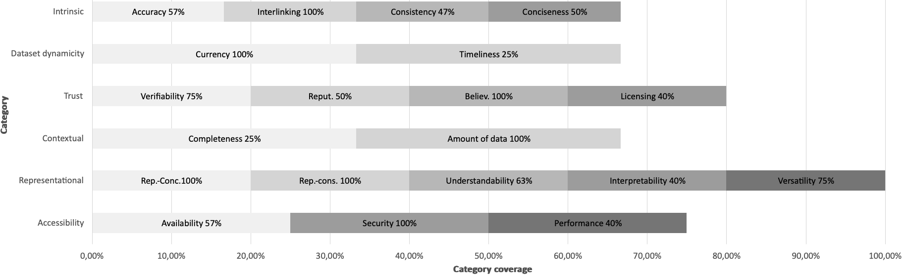
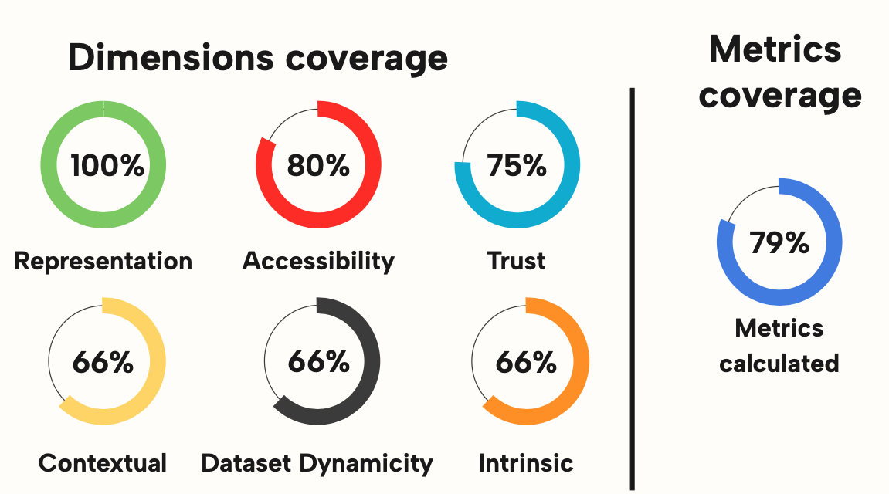
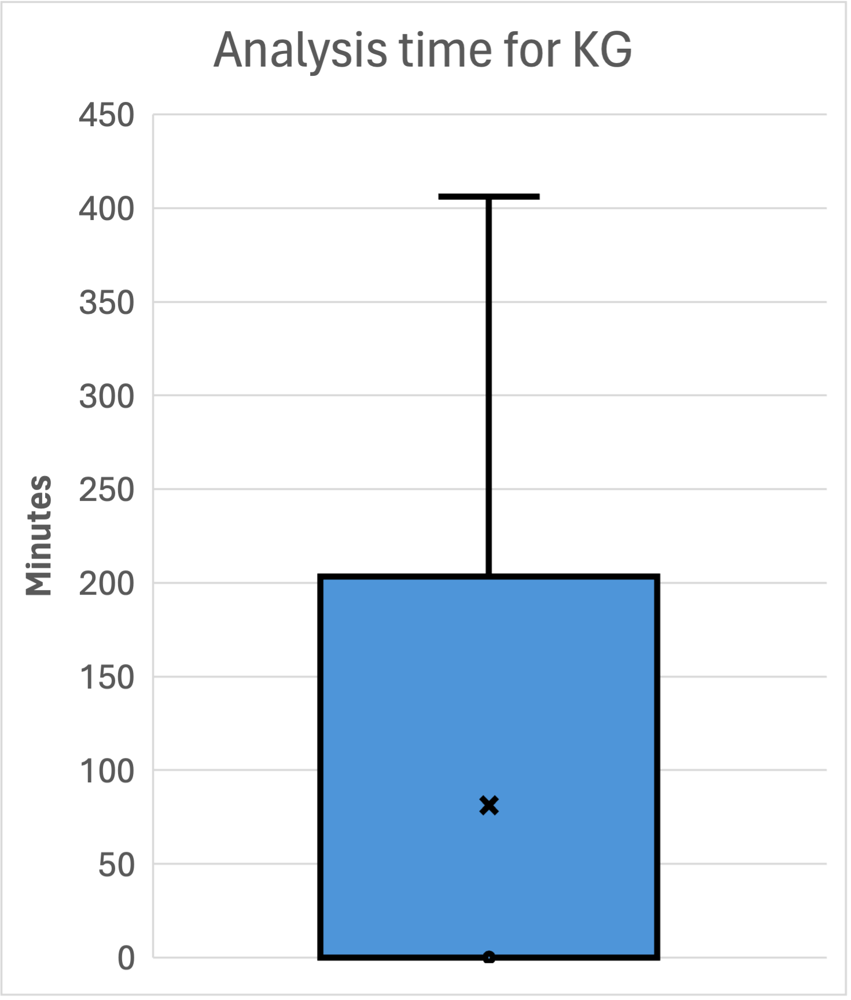

<p align="center">
  
</p>

<h1 align="center">KGHeartBeat</h1>

<p align="center">
  <i>An Open Source Tool for Periodically Evaluating the Quality of Knowledge Graphs</i>
</p>

---

# Table of contents
- [Repository structure](#repository-structure)
- [Quality metrics covered](#quality-metrics-covered)
- [Examples](#examples)
- [Test](#test)
- [Performance](#performance)
- [License](#license)

- [How To Use KGHeartbeat?](#how-to-use-kgheartbeat)
    - [Dependencies](#dependencies)
    - [Input configuration](#input-configuration)
    - [Results](#results)
    - [Look directly the quality](#look-directly-the-quality)
- [How include a new quality metric?](#how-include-a-new-quality-metric)
- [How to cite our work](#how-to-cite-our-work)
- [Generate RDF graph from csv (ESWC Workshop)](./Generate%20KG%20from%20csv%20(ESWC%20Workshop)/)
- [Roadmap](#roadmap-)

## Repository structure
```
KG-HeartBeat
    | - Analysis results/       Directory with KGs data quality obtained from measurement.
        |- YYYY-MM-DD.csv     
    | - API/                   
        |- AGAPI                Interface to KnowledgeGraph search engine.
        |- Aggregator.py        Brings together all the metadata for the KG from the various services used.
        |- DataHubAPI.py        Module to retrieve KGs metadata from DataHub.
        |- LODCloudAPI.py       Module to retrieve KGs metadata from LODCloud.
        |- LOVAPI.py            Module used to retrieve standard vocabularies and terms from LOV.
    | - db_files/
        |- docker-compose.yml   File to create a MongoDB container to contain the analysis data (useful only for the Web-App)     
        |- docker-entrypoint-initdb.d
           |- init-mongo.js     Script to create DB and collection.
    | - docs/                   Contains file related to the documentation.
    | - examples/               Contains example on how to use KGHeartBeat
    | - QualityDimensions       All classes representing the measured quality dimensions.
        |- AmountOfData.py
        |- Availability.py
        |- Believability.py
        ...
        ...
        ...
    | - test/                   Folder containing files and scripts relating to the test
        |- analyses_test.py     Script to run the test 
        |- SPARQLES_APIS.py     Module used as interface to the SPARQLES API.
        |- test_output.txt      File containing the result of the test performed.
    | - WebApp/                 Directory that contains all the files needed to boot locally KGHeartBeat Web-App.
    | - analyses.py             Module that calculates all quality metrics.
    | - bloomfilter.py          Class used to istantiate the Bloom-Filter structure.
    | - Configuration.py        Module used to create the configration.json file if isn't available.
    | - db_interface.py         Allows you to insert new quality data into the DB.
    | - ExternalLink.py         Class used to model the external links of a KG.
    | - Graph.py  Module        Used to build the graph with all the KGs and to calculate all the interlinking dimension metric.
    | - InputValidator.py       Abstract class to validate the input.
    | - JsonValidator.py        Class that implements the validation of JSON files in input.
    | - KnowledgeGraph.py       Class that contains the quality data of for the KG.
    | - manager.py              Module responsible for orchestrating the application and calling the various modules for analysis.
    | - MetricsOutput.py        Abstract class to return output from the application.
    | - OutputCSV.py            Class used to shape the output in CSV format.
    | - query.py                Contains all the queries needed to calculate quality metrics.
    | - Resources.py            Class used to aggregate all resources available for the analyzed KG.
    | - score.py                Class that calculates the score for each quality dimension analyzed and the total score
    | - Sources.py              Class with all info related to the KG sources.
    | - utils.py                Aggregates all useful functions for calculating quality metrics.
    | - VoIDAnalyses.py         Module used for parsing and extracting all useful information from the VoID file

```


## Quality metrics covered
Below is a graph showing the quality dimensions covered by KGHeartbeat and the percentage of metrics measured in each of them.




The following figure shows the percentage of sizes and categories covered by KGHeartBeat.


## Examples
1. [What are the best KGs for automatic consumption in the context of cultural heritage?](./examples/README.md#1-what-are-the-best-kgs-for-automatic-consumption-in-the-context-of-cultural-heritage)
2. [What are the best 10 KGs in terms of Trust and Dataset dynamicity?](./examples/README.md#2-what-are-the-best-10-kgs-in-terms-of-trust-and-dataset-dynamicity)
3. [What are the best KGs in the context of Linguistic Linked Open Data?](./examples/README.md#3-what-are-the-best-kgs-in-the-context-of-linguistic-linked-open-data)

## Test
The test was performed by comparing KGHeartBeat with [SPARQLES](https://sparqles.demo.openlinksw.com/). For more info about the test and the result go to the [test readme](./test/).

## Performance
At the end of the analysis execution, in the root directory of the project there will be a [performance.txt](./performance.txt) file, which will contain various information on the time taken for the analysis of each KG (with the time for the calculation of each metric) and the time of the analysis in total. The performance data that we illustrate below, and the file provided in the repository, refer to the analysis of all the KGs automatically discoverable carried out on 2023/12/24.

|Total KGs analyzed|Total time (hours)| Average time for the analysis of one KGs (minutes)| Standard deviation (minutes) |
|---|---|---|----|
|1882|89.40 ~ 4 days|2.82|21.24|

The KG that required the longest time for analysis was **B3Kat - Library Union Catalogues of Bavaria, Berlin and Brandenburg**, the total time was: ~6.77 hours. The quality metric that took the longest time to analyze was *Intrinsic Category -> Consistency -> Undefined classes*, with ~5 hours to complete the calculation, this is mainly due to the large amount of triples that are present in this KG (1.022.898.443 of triples).
The box plot illustred below shows the times for calculating the quality for each KGs. 

## License
KGHeartbeat is licensed under the [MIT License](https://opensource.org/license/mit/).

# How to Use KGHeartBeat
This section provides an overview about the use of KGHeartbeat and how it can be extended.
To follow the next steps, clone the project with the following command
```
git clone https://github.com/isislab-unisa/KGHeartbeat.git
```

## Dependencies
For the execution of the project it is recommended to create a Python Virtual Environment, so from the project root directory run the following commands:
```
pip install virtualenv
python<version> -m venv <virtual-environment-name>
source env/bin/activate 
// or for Windows users
env/Scripts/activate.bat //In CMD
env/Scripts/Activate.ps1 //In Powershel
```
First of all, install all dependencies from the project root:
```
pip install -r requirements.txt
```
## Input configuration
From the [KG-quality-analysis/configuration.json](configuration.json) file, you can choose the Knowledge Graph to analyze. You can analyze it by using a list of keywords or ids. In the example below, all the Knowledge Graphs that have the keywords *"museum"* will be analyzed.
```
{"name": ["museum"], "id": []}
```
Or, by a list of ids like this:
```
{"name": [], "id": ["dbpedia","taxref-ld"]}
```
If instead, you want to analyze all the Knowledge Graphs automatically discoverable from [LODCloud](https://lod-cloud.net/) and [DataHub](https://old.datahub.io/):
<a name="all-kgs-conf"></a>
```
{"name": [], "id": []}
```
After the input configuration, to execute the analysis simply launch form the main directory of the project:
```
python3 manager.py
```
## Results
The results of the analysis will be inserted in a .csv file in the *"Analysis results"* directory, along with a .log file containing any errors that occurred during the measurement. Each line of the csv file representa a KG, and on the columns we find the different quality metrics analyzed.

## Look directly the quality
An analysis of all automatically discoverable Knowledge Graphs is done weekly by a server in the [ISISLab laboratory](https://www.isislab.it/). 
You can view the quality data of each analysis performed in csv format in the following repository: [https://github.com/isislab-unisa/KGHeartBeat-historical-analysis](https://github.com/isislab-unisa/KGHeartBeat-historical-analysis)
Or, you can view the computed data through graphs and tables from our web-app: [KGHeartBeat-WebApp](http://www.isislab.it:12280/kgheartbeat/).

## How include a new quality metric?
If you want to include a new quality metric, you need to include the calculation inside the [analyses.py](analyses.py) module. If this new metric requires the use of a new query on the SPARQL endpoint, you can add a new query in the [query.py](query.py) module and call it from the [analyses.py](analyses.py) module .Then, based on the quality dimension to which it belongs, modify the related class in the [QualityDimensions](/QualityDimensions/) folder, or create a new class if this belongs to a new dimension. If you created a new dimension for the new metric, it must be included in the [KnowledgeGraph.py](KnowledgeGraph.py) class. Then instantiate the classes in the [analyses.py](analyses.py) to assign the value obtained from the new quality metric. If you want also to see this new metric in the csv file given in output, you need to edit the [OutputCSV.py](OutputCSV.py) module appropriately. Essentially you have to include a new header, having as name the name of the new metric and then recall the value of the metric from the [KnowledgeGraph.py](KnowledgeGraph.py) object appropriately constructed in the [analyses.py](analyses.py) module.

# How to cite our work
For citing KGHeartBeat in academic papers please use:

*Pellegrino, Maria Angela, Anisa Rula, and Gabriele Tuozzo. "KGHeartBeat: An Open Source Tool for Periodically Evaluating the Quality of Knowledge Graphs." International Semantic Web Conference. Cham: Springer Nature Switzerland, 2024.* 

Link to the paper: [https://link.springer.com/chapter/10.1007/978-3-031-77847-6_3r](https://link.springer.com/chapter/10.1007/978-3-031-77847-6_3)
```
@inproceedings{pellegrino2024kgheartbeat,
  title={KGHeartBeat: An Open Source Tool for Periodically Evaluating the Quality of Knowledge Graphs},
  author={Pellegrino, Maria Angela and Rula, Anisa and Tuozzo, Gabriele},
  booktitle={International Semantic Web Conference},
  pages={40--58},
  year={2024},
  organization={Springer}
}
```
## Roadmap 🚀
- [ ] Better filtering of inactive KGs from the Web-App, not just based on SPARQL endpoint (possible cue from YummyData).
- [ ] Increase the number of KGs monitored by the tool, including through the use of scraping in GitHub/Git Lab repositories (as suggested in the [#1 issue](https://github.com/isislab-unisa/KGHeartbeat/issues/1) by @vemonet).
- [ ] Grouping KGs with the same SPARQL endpoint, but referring to a different sub-graph.


