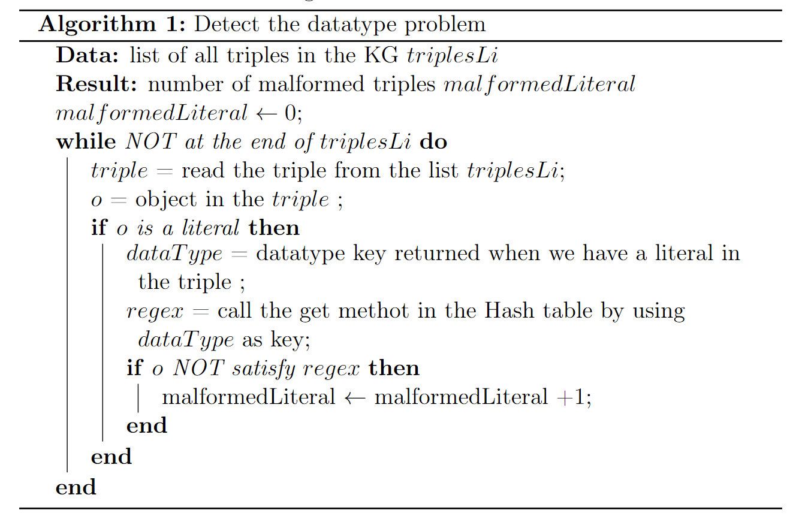
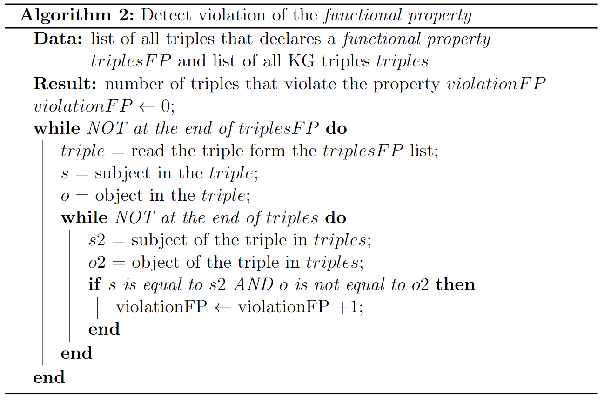
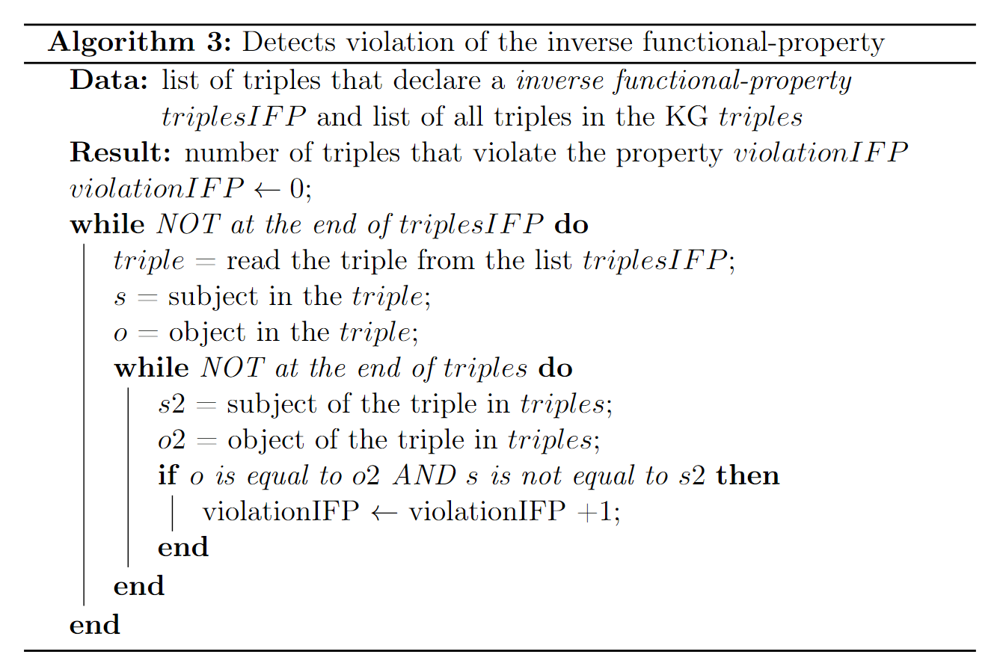

## Accuracy
1. [Empty label](#empty-label)
2. [Whitespace at the beginnig or end of the label](#whitespace-at-the-beginnig-or-end-of-the-label)
3. [Wrong datatype](#wrong-datatype)
4. [Functional property violation](#functional-property-violation)
5. [Inverse functional property violation](#inverse-functional-property-violation)

#### **Empty label**
For the calculation of this metric, we first recover the label in the KG with the follow query:
```sql
PREFIX skosxl:<http://www.w3.org/2008/05/skos-xl#>
PREFIX rdfs: <http://www.w3.org/2000/01/rdf-schema#>
PREFIX skos: <http://www.w3.org/2004/02/skos/core#>
PREFIX dcterms: <http://purl.org/dc/terms/>
PREFIX foaf: <http://xmlns.com/foaf/0.1/>
PREFIX awol: <http://bblfish.net/work/atom-owl/2006-06-06/#>
PREFIX wdrs: <http://www.w3.org/2007/05/powder-s#>
PREFIX schema: <http://schema.org/>
SELECT (COUNT(?o) AS ?triples)
WHERE{
{?s rdfs:label ?o}
UNION
{?s foaf:name ?o}
UNION
{?s skos:prefLabel ?o}
UNION
{?s dcterms:title ?o}
UNION
{?s dcterms:decription ?o}
UNION
{?s rdfs:comment ?o}
UNION
{?s awol:label ?o}
UNION
{?s dcterms:alternative ?o}
UNION
{?s skos:altLabel ?o}
UNION
{?s skos:note ?o}
UNION
{?s wdrs:text ?o}
UNION
{?s skosxl:altLabel ?o}
UNION
{?s skosxl:hiddenLabel ?o}
UNION
{?s skosxl:prefLabel ?o}
UNION
{?s skosxl:literalForm ?o}
UNION
{?s schema:name ?o}
UNION
{?s schema:description ?o}
UNION
{?s schema:alternateName ?o}
```
We have a lot of predicates beacuse we have different mechanism to attach a label on a triple. All the labels recovered are compared with the empty string. If we found an empty label, then we increment a counter named ```emptyAnnotation```. At the end of the process we use the follow formula to to quantize the metric, where $L_{KG}$ is the number of KG labels:

$$
m_{label} = 1.0 - \frac{emptyAnnotation}{|L_{KG}|} 
$$

---

#### **Whitespace at the beginnig or end of the label**
Always using the query to retrieve all the labels on the triples (which we saw [here](#empty-label)), but this time scrolling through the different labels we go to apply the strip() function on each of the labels, Then, the string obtained is compared with the one before applying the function and if they are the same, it means that the label did not present the problem of spaces, otherwise a $wSP$ counter is incremented. At the end of the process, the following formula is applied to obtain the value of the data, where $L_{KG}$ is the number of KG labels.

$$
m_{wsLabel} = 1.0 - \frac{wSP}{|L_{KG}|}
$$

---

#### **Wrong datatype**
In this case we used the W3C documentation available [here](https://www.w3.org/TR/xmlschema11-2/). From this document, in addition to the data types, for each of them the regex has also been indicated which defines the range of values that it can take on. In our application an hash table was therefore created, where each entry is made up of a key, which is one of the data types, while the value is the corresponding regex which determines the domain. At this point we just have to catch up
all triples from the KG and filter out those that contain a literal to perform the type checking (the check can also be done directly with a query on the SPARQL endpoint, but this often leads to overloading and the query might fail). The value calculation mechanism is given by the following pseudo code.

<p align="center">
    
</p>

#### **Functional Property violation**
For the calcuation of this metric we have followed the definition given [here](https://www.w3.org/TR/owl-ref/#FunctionalProperty-def). For identify the functional property violation we first recover all triples that are a declaration of a functional property with the following query:
```sql
PREFIX owl: <http://www.w3.org/2002/07/owl#>
SELECT *
WHERE
{?s owl:FunctionalProperty ?o.}
```

At this point we verify that there isn't any triples in the KG that have the same subject but with different object, if this triple exist, the triple violate the functional property. With the following algorithm, we automatize the metric calculation.

<p align="center">
    
</p>

After the calculation of the number of triples that violate the functional property we use the following formula to quantize the metric, where $T_{KG}$ is the set of all triples in the KG:

$$
m_{FP} = \frac{violationFP}{|T_{KG}|}
$$

---

#### **Inverse functional property violation**
For the calculation of this metric we have followed the definition given [here](https://www.w3.org/TR/owl-ref/#InverseFunctionalProperty-def). We first recover all the triples in the KG with the $owl:InverseFunctionalProperty$ predicate by using the following query:
```sql
PREFIX owl: <http://www.w3.org/2002/07/owl#>
SELECT *
WHERE
{?s owl:InverseFunctionalProperty ?o.}
```
Then with the following algorithm we obtain the number of triples that violate the inverse functional property.

<p align="center">
    
</p>

The following formula instead, allow us to quantize the metric (where $T_{KG}$ is the set with all the KG triples):

$$
m_{IFP} = 1.0 - \frac{violationIFP}{|T_{KG}|}
$$