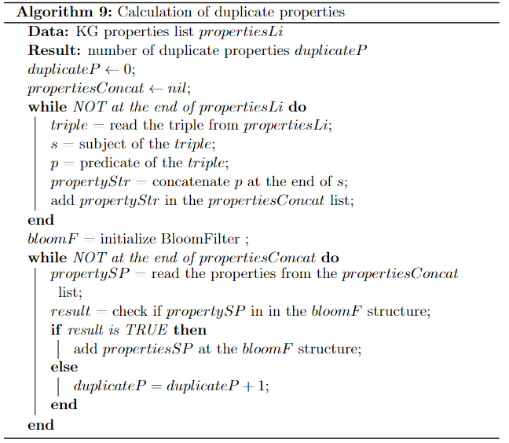
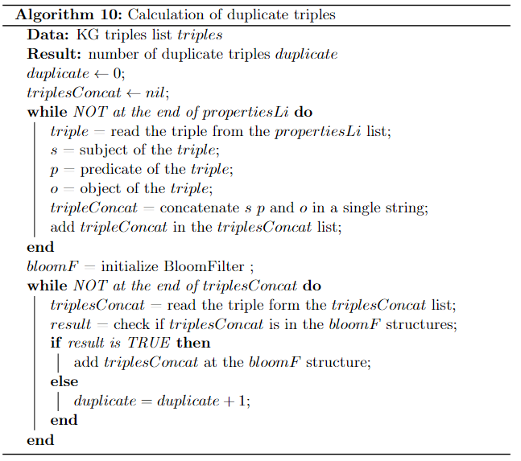

## Intrinsic category

### Conciseness
1. [Intensional conciseness](#intensional-conciseness)
2. [Extensional conciseness](#extensional-conciseness)

### **Conciseness**
For the calculation of both metrics we use the probabilistic Bloom filter algorithm. For calculation of both types of values we are going to use this type of algorithm that helps us detect any duplicates in the data.

#### **Intensional conciseness**
In this case we need to check if there are any duplicate properties within the dataset. We use the following query for recover all the triples that are declared as properties in the KG.

```sql
PREFIX owl: <http://www.w3.org/2002/07/owl#>
PREFIX skos: <http://www.w3.org/2004/02/skos/core#>
PREFIX rdf: <http://www.w3.org/1999/02/22-rdf-syntax-ns#>
SELECT DISTINCT ?s ?p
WHERE {
{ ?s ?p rdf:Property}
UNION
{?s ?p owl:DatatypeProperty}
UNION
{?s ?p skos:Property}
}
```
Once we have obtained the list of properties we can apply the following algorithm to detect any duplicates.

<p align="center">

</p>

Finally, to obtain the value of Intentional conciseness, we use the following formula, where $duplicateP$ and $propertiesConcat$ come from the output of the previous algorithm:

$$
m_{intC} = 1.0 - \frac{duplicateP}{|propertiesConcat|}
$$


#### **Extensional conciseness**
In this case, instead of simply checking the duplication of properties, we will measure any redundancy between all the triples of the KG. First we retrieve all the data contained in the dataset.

```sql
SELECT *
WHERE{?s ?p ?o}
```
Then we apply the following algorithm:

<p align="center">

</p>

In the end the value of extensional conciseness is given by the formula that follows, where $duplicates$ and $triplesConcat$ come as output from the previous algorithm.