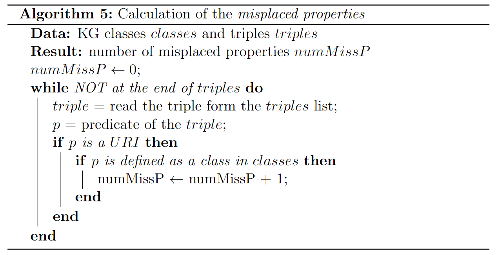
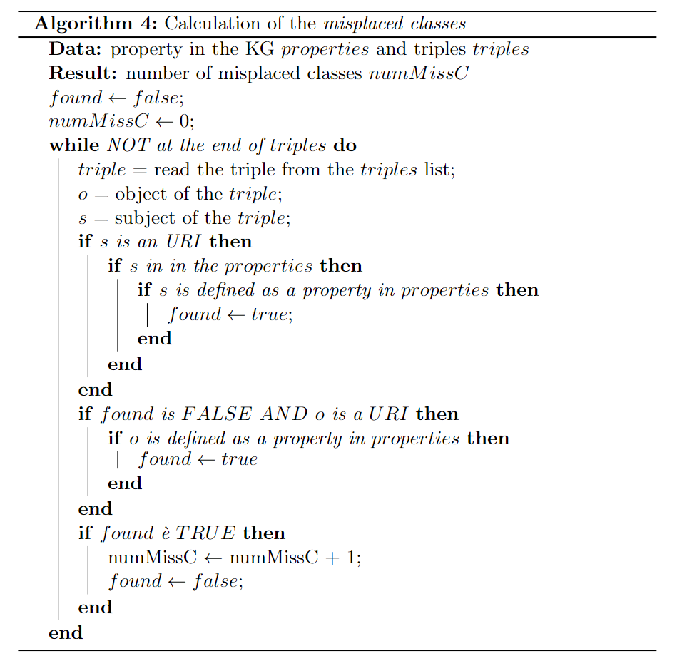
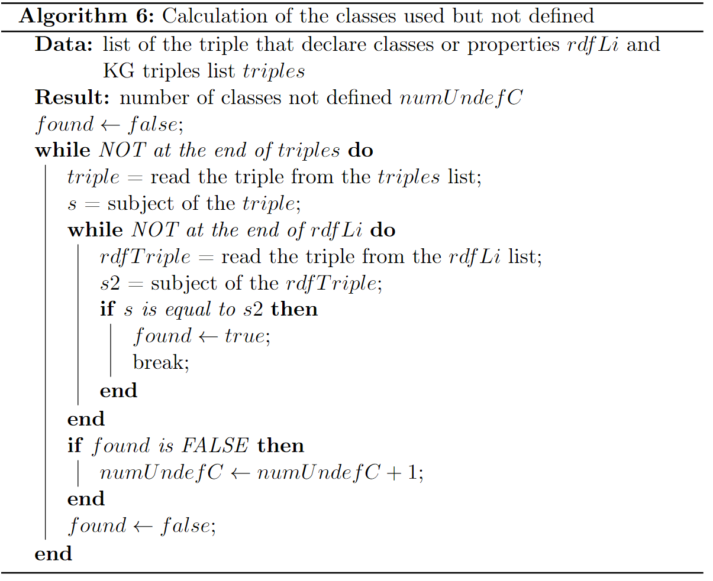
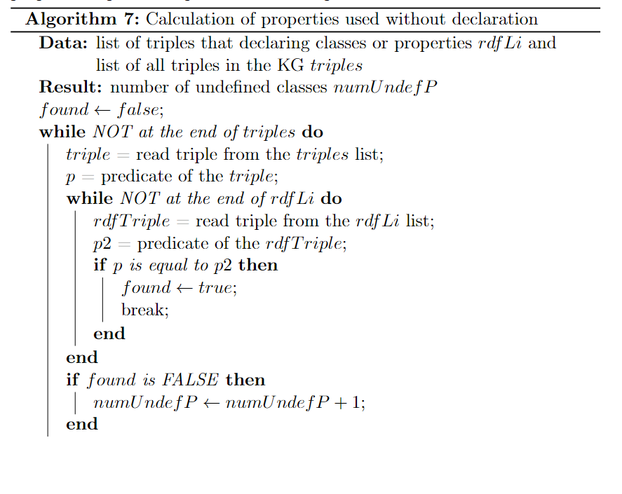
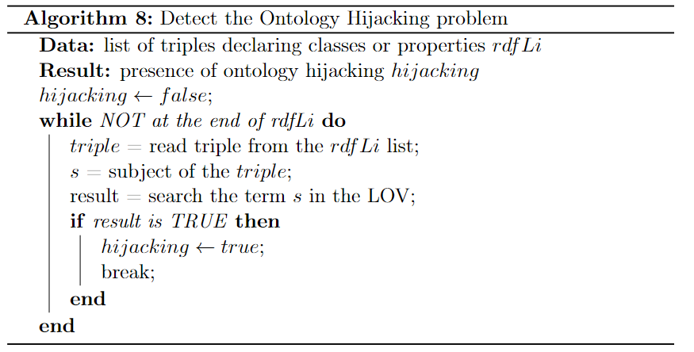

## Consistency
1. [Number of entities defined as member of disjoint class](#number-of-entities-defined-as-member-of-disjoint-class)
2. [Misplaced classes](#misplaced-class)
3. [Misplaced properties](#misplaced-properties)
4. [Deprecated classe and properties](#deprecated-classes-and-deprecated-properties)
5. [Undefined classes](#undefined-classes)
6. [Undefined properties](#undefined-properties)
7. [Ontology Hijacking](#ontology-hijacking)

### **Consistency**

#### **Number of entities defined as member of disjoint class**
For the calculation of this metric we first execute the following query on the SPARQL endpoint for recover all the triples with the $owl:disjointWith$ predicate:
```sql
PREFIX owl: <http://www.w3.org/2002/07/owl#>
SELECT DISTINCT (COUNT(?s) AS ?triples)
WHERE
{?s owl:disjointWith ?o.}
```
To obtain the final value of the metric, we need also the number of entities in the KG. To recover this number, we follow the same method described [here](./amount_of_data#number-of-entities). Lastly, with the following formula we obtain the value of the metric (where $E_{KG}$ is the set of all KG entities and $disjV$ is the number of triples recovered with the previuos query).

$$
m_{disjV} = \frac{numDisj}{E_{KG}}
$$

---

#### **Misplaced class**
For this metric we have to check if there is any class (declared like this in the KG) that is used as property and this mean that is used as predicate in the triple. We first recover all the properties in the KG with the following query:

```sql
PREFIX owl: <http://www.w3.org/2002/07/owl#>
PREFIX skos: <http://www.w3.org/2004/02/skos/core#>
PREFIX rdf:  <http://www.w3.org/1999/02/22-rdf-syntax-ns#>
SELECT DISTINCT ?o
WHERE {
{ ?o a rdf:Property}
UNION
{?o a owl:DatatypeProperty}
UNION
{?o a skos:Property}
UNION
{?o a owl:DatatypeProperty}
UNION
{?o a owl:AnnotationProperty}
UNION
{?o a owl:OntologyProperty}
UNION
{?o a rdfs:subPropertyOf}
UNION
{?o a rdfs:Property}
}
```
Then with the following algorithm we calculate the number of triples with this problem

<p align="center">
    
</p>

In the end, the following formula allow us to quantize the metric:

$$
m_{mispP} = 1.0 - \frac{numMissP}{|T_{KG}|}
$$

#### **Misplaced properties**
In this case however we must ensure that values defined as properties are not used as classes. With the following query we obtain all the classes declared in the KG:

```sql
PREFIX owl: <http://www.w3.org/2002/07/owl#>
PREFIX rdf: <http://www.w3.org/1999/02/22-rdf-syntax-ns#>
SELECT DISTINCT ?s
WHERE {?s rdf:type owl:Class}
```
With the following algorithm instead we count the number of triples that have this problem.

<p align="center">
    
</p>

Finally, the following formula help us to quantize the metric (where $T_{KG}$ is the set of all triples in the KG):

$$
m_{mispP} = 1.0 - \frac{numMissP}{T_{KG}}
$$


---

#### **Deprecated classes and deprecated properties**
For the calculation of this metric, we execute the following query that count the number of triples in the KG with the predicate ```owl:DeprecatedClass``` and ```owl:DeprecatedProperty```. Note that we rely on the fact that whoever created the dataset knows that that class or property is deprecated, but uses it by reporting it.

```sql
PREFIX rdf: <http://www.w3.org/1999/02/22-rdf-syntax-ns#>
PREFIX owl: <http://www.w3.org/2002/07/owl#>
SELECT DISTINCT ?s
WHERE{
{?s rdf:type owl:DeprecatedClass}
UNION
{?s rdf:type owl:DeprecatedProperty}
}
```
Then we quantize it with the following formula, in which $C_{KG}$ and P_{KG} are respectively the set of all classes and the set of all properties in the KG, and $numDeprecated$ is the value return by the previuos query,

$$
m_{deprec.} = 1.0 - \frac{numDeprecated}{|C_{KG} + P_{KG}|}
$$

---

#### **Undefined classes**
It is necessary to verify that there is no use of classes that have not been appropriately defined. With the following query we recover all classes and properties declarations that are executed.
```sql
PREFIX rdf: <http://www.w3.org/1999/02/22-rdf-syntax-ns#>
SELECT DISTINCT ?s
WHERE {?s rdf:type ?o}
```

And then we use the following algorithm

<p align="center">
    
</p>

This formula, where $T_{KG}$ is the set of all KG triples

$$
m_{undefC} = 1.0 - \frac{numUndefC}{T_{KG}}
$$

give us the metric value.

---

#### **Undefined properties**
The calculation of this metric is equal to the previous, but in this case we focus on the properties, that is, on the predicate in the triple.

<p align="center">
    
</p>

Similar to the previous case, the following formula allow us to quantize the metric, where $T_{KG}$ is the set of all KG triples.

$$
m_{undefP} 1.0 - \frac{numUndefP}{|T_{KG}|}
$$

#### **Ontology Hijacking**
We need the terms defined inside the KG, to check whether standard terms have been redefined. Let's recover all classes and properties declarations in the same way as done for the undefined classes and undefined properties, by using the same query used [here](#undefined-classes). Then we use the [Linked Open Vocabulary](https://lov.linkeddata.es/dataset/lov) [REST API](https://lov.linkeddata.es/dataset/lov/api) (LOV), to search if the selected one is a standard term. The following algorithm allow us to detect the problem:

<p align="center">
    
</p>

If the problem is present, the data is assigned a value
1, otherwise 0.