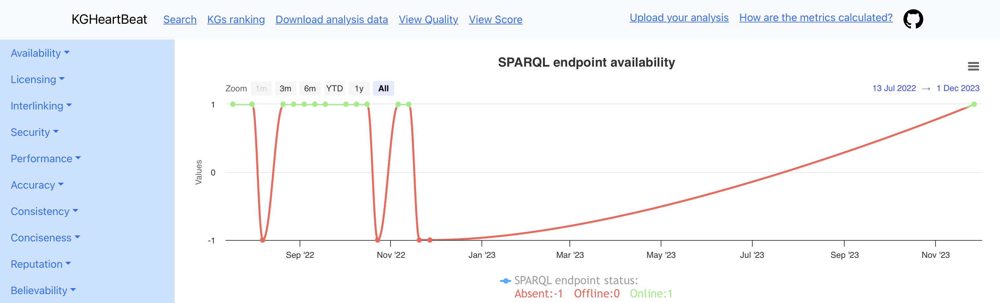
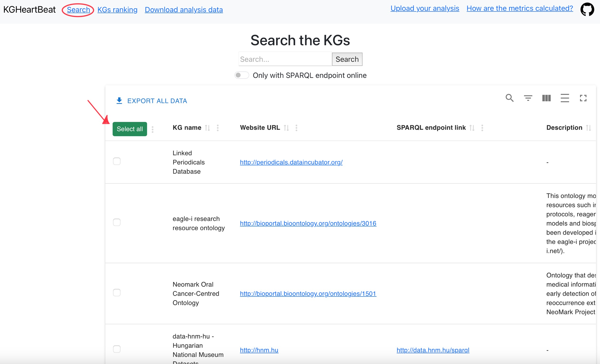
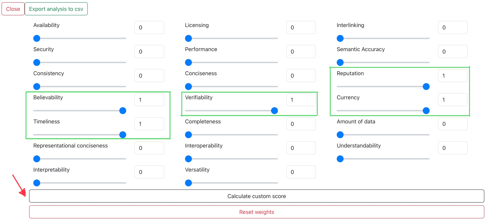
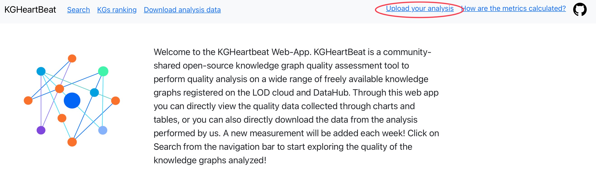
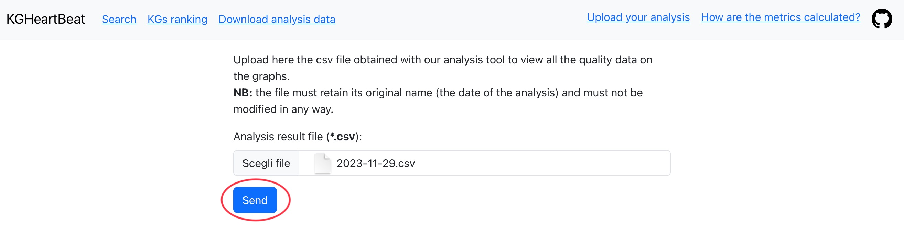
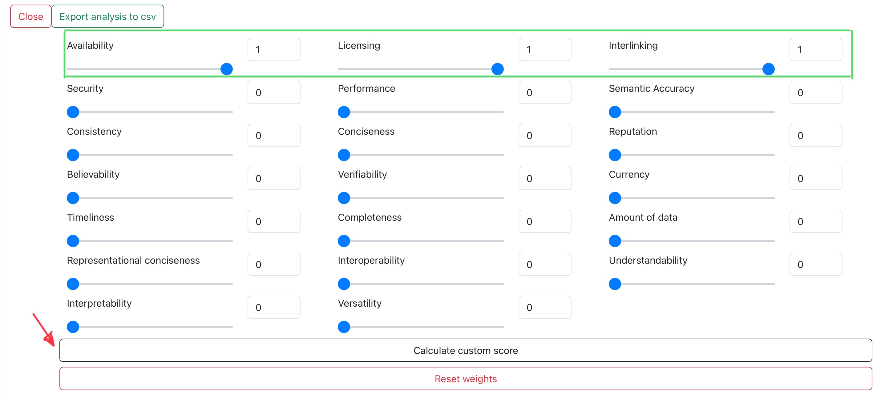

# Examples
To easily reproduce the examples it is also possible to use the archives containing the analysis results. However, in the following examples we will detail how to obtain them directly as output from KGHeartBeat. These examples can also be reproduced by uploading the csv file to the [KGHeartbeat-WebApp](http://www.isislab.it:12280/kgheartbeat/), from the *upload you analysis section*, it is possible to directly upload the csv file output by KGHeartbeat and view and personalize the score from the -> View score section, without having to search for the data in the right columns.

### 1. What are the best KGs for automatic consumption in the context of cultural heritage?
We can filter the Knowledge Graphs to analyze using appropriate keywords to exclude those that do not interest us. For example we can use the following keywords: museum, library, archive, cultur, heritage, bibliotec, natural, biodiversity, geodiversity. Then the configuration.json file will be configured as follows:
```
{"name": ["museum", "library", "archive", "cultur", "heritage", "bibliotec" "natural", "biodiversity", "geodiversity"], "id": []}
```
Our tool in this case give us the following output:
```
Number of KG found with keyword cultur:118
Connection to API successful and data recovered
Number of KG found with keyword heritage:50
Connection to API successful and data recovered
Number of KG found with keyword bibliotec:18
Connection to API successful and data recovered
Number of KG found with keyword natural:67
Connection to API successful and data recovered
Number of KG found with keyword biodiversity:11
Connection to API successful and data recovered
Number of KG found with keyword geodiversity:0
```
And then the analysis phase begins (Be careful, given the large number of KGs, this may take a long time to complete, depending on the load of the servers hosting the KG and your internet connection). At the end of the analysis we will be able to visualize the quality of the KGs analyzed through the csv file produced in the [Analysis results](/Analysis%20results/) folder, having as its name the date of execution of the analysis (if you don't want to perform analysis, you can use the csv file in the ```Cultural-heritage_2023-11-27.zip``` archive).
In this case we are particularly interested in understanding the availability of the SPARQL endpoint, as the goal is to build a virtual assistant, which is always available to respond at different questions. On the csv file, we can sort the records based on the availability score, in descending order, at this point the first KG is the best for our purposes. From the point of view of availability, the best is B3Kat - Library Union Catalogs of Bavaria, Berlin and Brandenburg. At this point, we can use [KGHeartbeat-WebApp](http://www.isislab.it:12280/kgheartbeat/), to make sure that for this specific KG, there is a certain stability over time of the SPARQL endpoint (in fact, it can happen that at the moment of the analysis it is online, but over time it often turns out to be fluctuating). We can therefore take as an example the first three KGs that have the best score for availability and search for them on the Web-App to see if they have a stable SPARQL endpoint over time. This step is important, because for example the *WASABI RDF Knowledge Graph*, which appears as the third KG, if we search it on the Web-App and the click on the Availability -> SPARQL endpoint, we can see that the SPARQL endpoint it's not very stable.

This clarifies how useful our tool can be to easily guide you in choosing the best KG, thanks to the temporal observation of the qualities. 

---
### 2. What are the best 10 KGs in terms of Trust and Dataset dynamicity?

To reproduce this example, it is recommended to use the csv file in the ```AllKGs_2023-11-27.zip``` archive, instead of directly analyzing all KGs (as illustrated [here](../README.md#all-kgs-conf)), to reproduce this example, which could take some time. In this example the objective is to observe those KG have the highest value in the following dimensions (the value of the column to search for in the csv file is reported in brackets):
 - Verifiability (Verifiability score)
 - Reputation (Reputation score)
 - Believability (Believability score)
 - Currency (Currency score)
 - Timeliness (Timeliness score)

We can sort the columns in descending order and see which are the best KGs, but since we need to look at the value for multiple quality dimensions, in this case [KGHeartbeat-WebApp](http://www.isislab.it:12280/kgheartbeat/) comes to our aid! We can upload the csv file, as detailed before, or from the search screen we select all the KGs:

Then click on the view score button from the navigation bar and then click on customize score and configure the sliders like the image below:

Scrolling the page, in the second table (the first contains the values of the non-personalised score, useful for comparing how it changes with the modified one) a table will appear whose *Score* value will be personalized taking into account only the dimensions that have been set to 1, setting all the others to 0. Consequently, the KG with the highest score will be the one that best meets our requirements.
### 3. What are the best KGs in the context of Linguistic Linked Open Data?

The data used for this example refers to the csv file in the ```linguistic_2023-11-29.zip``` archive. If instead you want to directly run the tool to perform the analysis to obtain real-time data, you can use the following configuration for the configuration.json file:
```
{"name": ["linguistic"], "id": []}
```

According to the [LLOD Cloud](https://linguistic-lod.org), remarkable care should be dedicated to the licensing, availability, and interlinking quality dimensions, for this kind og KGs. Also for this use case we can proceed as the previous one, i.e. uploading the analysis data directly to the [KGHeartbeat-WebApp](http://www.isislab.it:12280/kgheartbeat/) (this relieves us from the work of having to use a spreadsheet and look at the score of each dimension to understand which is the best). As a first step we upload the csv file to the Web-App (you can use the one you find in the examples/ folder or directly the one you obtained from KGHeartBeat with the configuration indicated previously, in both cases, do not modify the file in any part, filename included). Upload the image as shown in the image below:


Then click on the view score button from the navigation bar and then click on customize score and configure the sliders like the image below:

Scrolling the page, in the second table a table will appear whose *Score value* will be personalized taking into account only the dimensions that have been set to 1, setting all the others to 0. Consequently, the KG with the highest score will be the one that best meets our requirements.